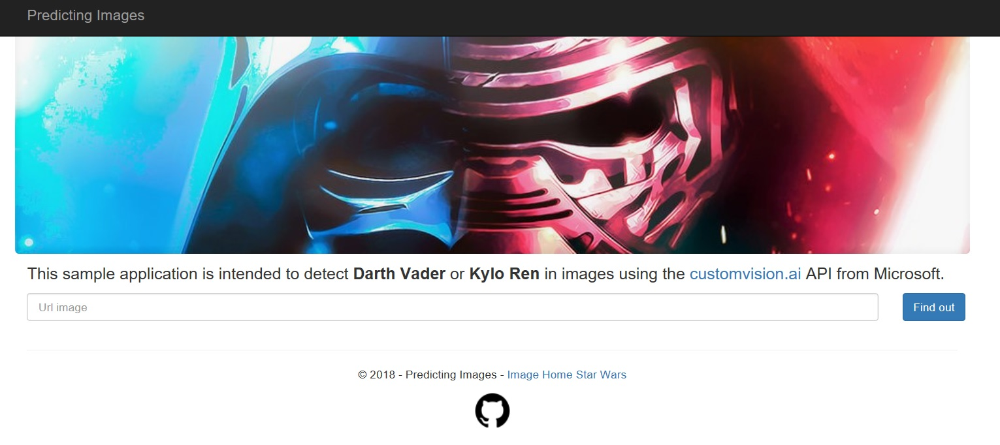
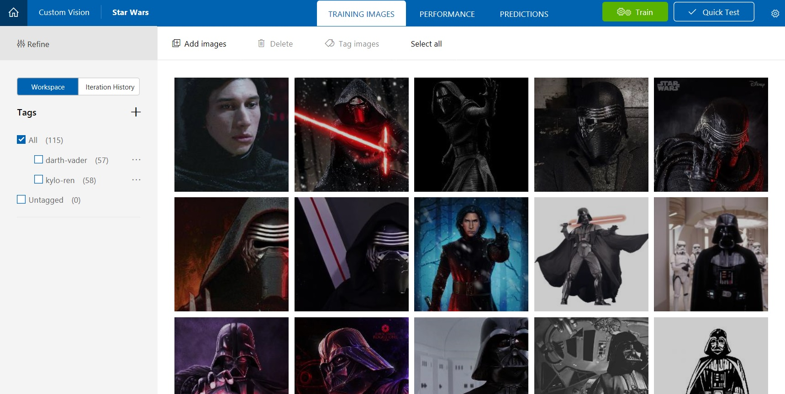

# Cognitive Services

This project aims to test and present several tools for the classification of images.

## Custom Vision Microsoft

<a href="https://customvision.ai" target="_blank">Custon Vision</a> is a Microsoft service used for image classification. This service is a new version of <a href="https://www.microsoft.com/cognitive-services/en-us/computer-vision-api" target="_blank">Microsoft’s Computer Vision API</a> that allows users to specialize a pre-trained model (ResNet, AlexNet) using images they want to sort.

### Application created to test Microsoft Cognitive Service API

You can test that service accessing this <a href="https://predictimages.azurewebsites.net/" target="_blank">application</a>. To test, you must copy the url of some image with Darth Vader or Kylo Ren on the internet and paste it into the input field of the application.
Examples:
* <a href="https://geeksaw.com.br/wp-content/uploads/2017/03/darth-vader-1-cover-header.jpg" target="_blank">Darth Vader</a>
* <a href="http://ambrosia.com.br/wp-content/uploads/2015/12/Kylo-Ren-In-Star-Wars.jpg" target="_blank">Kylo Ren</a>

### Custom Vision interface to train the model

Below, you can see the <a href="https://customvision.ai" target="_blank">Custom Vision Application</a>. In this app, it is possible upload images, train the model and predict images. The interface is simple and easy to use, but you must have a Microsoft Account.

### Demonstration

Do you have any questions? msgrubler@gmail.com