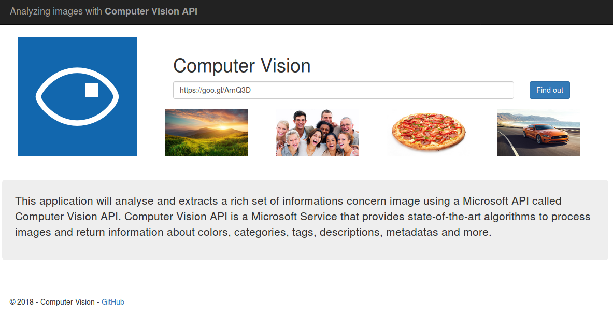
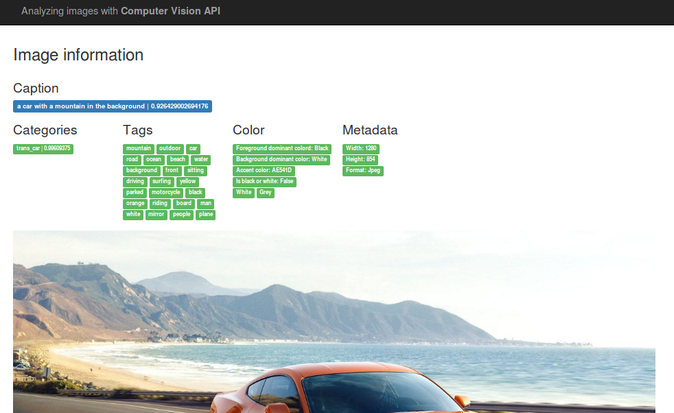

# Computer Vision Microsoft

<a href="https://azure.microsoft.com/pt-br/services/cognitive-services/computer-vision/">Computer Vision API</a> is a cognitive tool from Microsoft to analyze images. This tool is capable of performing visual analysis on images, detecting various characteristics such as the image's category, people, tags, colors, whether the content is adult or not.

## Application created to test the tool Computer Vision Microsoft

This <a href="https://analyzingimages.azurewebsites.net/">application</a> analyzes the images and shows the results below, according to the next images. The Microsoft tool facilitates cross-platform integration through the REST API, which sends the content type and key in the header and image in the body. It is possible to obtain a temporary key through this <a href="https://azure.microsoft.com/pt-br/try/cognitive-services/?api=computer-vision">url</a> (for 30 days), or by creating a Windows Azure account.

First page with input to analyse information about image.

Result of analysis showed in labels.

Do you have any questions? Send a message to msgrubler@gmail.com
